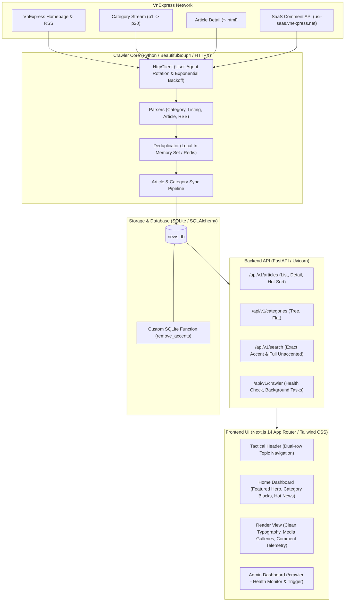

# VnExpress News Aggregator & Telemetry Reader

> Hệ thống tự động thu thập, khử trùng lặp, lưu trữ và cung cấp giao diện đọc báo VnExpress tối giản, tốc độ cao theo phong cách **Tactical Telemetry Brutalist** (màu nền Cyberpunk đen tối giản, điểm nhấn đỏ neon `#E61919`, font monospace, lược bỏ hoàn toàn quảng cáo và theo dõi người dùng).

---

## Mục Lục
1. [Kiến Trúc Hệ Thống](#kiến-trúc-hệ-thống)
2. [Cấu Trúc Trang & Quy Tắc Phân Trang VnExpress](#cấu-trúc-trang--quy-tắc-phân-trang-vnexpress)
3. [Cơ Chế Bóc Tách Lượt Bình Luận (Comment Extraction)](#cơ-chế-bóc-tách-lượt-bình-luận-comment-extraction)
4. [Khử Trùng Lặp Thông Minh (Deduplication)](#khử-trùng-lặp-thông-minh-deduplication)
5. [Cài Đặt & Khởi Chạy](#cài-đặt--khởi-chạy)
6. [Bộ Lệnh CLI Hoàn Chỉnh](#bộ-lệnh-cli-hoàn-chỉnh)
7. [Bộ Lệnh Minh Họa Cào Đủ Cho "Khoa Học Công Nghệ"](#bộ-lệnh-minh-họa-cào-đủ-cho-khoa-học-công-nghệ)
8. [Chiến Lược Cào Tin Khuyến Nghị (Best Practices)](#chiến-lược-cào-tin-khuyến-nghị-best-practices)
9. [Bộ Lọc & Tìm Kiếm Tiếng Việt Có Dấu / Không Dấu](#bộ-lọc--tìm-kiếm-tiếng-việt-có-dấu--không-dấu)
10. [Kiểm Thử (Testing) & Khôi Phục Dữ Liệu](#kiểm-thử-testing--khôi-phục-dữ-liệu)

---

## Kiến Trúc Hệ Thống



---

## Cấu Trúc Trang & Quy Tắc Phân Trang VnExpress

VnExpress tổ chức bài viết theo cấu trúc phân tầng:

### 1. Chuyên mục cha & các chủ đề con (Subtopics)
Ví dụ với chuyên mục **Khoa học Công nghệ** (`/khoa-hoc-cong-nghe`):
- **Trang chủ chuyên mục**: `https://vnexpress.net/khoa-hoc-cong-nghe`
- **Các chủ đề con (Subtopics)**:
  - Hoạt động Bộ KH&CN: `https://vnexpress.net/khoa-hoc-cong-nghe/bo-khoa-hoc-va-cong-nghe`
  - Chuyển đổi số: `https://vnexpress.net/khoa-hoc-cong-nghe/chuyen-doi-so`
  - Đổi mới sáng tạo: `https://vnexpress.net/khoa-hoc-cong-nghe/doi-moi-sang-tao`
  - Trí tuệ nhân tạo (AI): `https://vnexpress.net/khoa-hoc-cong-nghe/ai`
  - Vũ trụ: `https://vnexpress.net/khoa-hoc-cong-nghe/vu-tru`
  - Thế giới tự nhiên: `https://vnexpress.net/khoa-hoc-cong-nghe/the-gioi-tu-nhien`
  - Thiết bị: `https://vnexpress.net/khoa-hoc-cong-nghe/thiet-bi`
  - AI4VN: `https://vnexpress.net/khoa-hoc-cong-nghe/ai4vn-2026`
  - Tech Awards: `https://vnexpress.net/khoa-hoc-cong-nghe/tech-awards`
  - Sáng kiến khoa học: `https://vnexpress.net/khoa-hoc-cong-nghe/cuoc-thi-sang-kien-khoa-hoc`

### 2. Quy tắc phân trang (1 đến 20 trang)
- **Trang 1**: Có cấu trúc đa container (`wrapper-topstory-folder`, `news-container01` đến `04`), chứa bài tiêu điểm và luồng tin mới nhất.
- **Trang 2 đến 20**: Tuân theo quy tắc gắn hậu tố `-p{trang}`:
  - Trang 2: `https://vnexpress.net/khoa-hoc-cong-nghe-p2`
  - Trang 3: `https://vnexpress.net/khoa-hoc-cong-nghe-p3`
  - ...
  - Trang 20: `https://vnexpress.net/khoa-hoc-cong-nghe-p20`
- **Chủ đề con cũng có 20 trang tương tự**:
  - `https://vnexpress.net/khoa-hoc-cong-nghe/ai-p2` ... `ai-p20`
  - `https://vnexpress.net/khoa-hoc-cong-nghe/thiet-bi-p2` ... `thiet-bi-p20`

### 3. Cấu trúc URL bài viết đơn lẻ
Mọi bài báo trên VnExpress đều kết thúc bằng mã ID số nguyên duy nhất:
- `https://vnexpress.net/video-ngan-tu-youtuber-viet-tang-hon-100-sau-mot-nam-5121093.html` (ID: `5121093`)
- `https://vnexpress.net/canon-eos-r8-mark-ii-may-anh-full-frame-gia-45-trieu-dong-5121082.html` (ID: `5121082`)
- Bài tổng thuật: `...-5121155-tong-thuat.html` (ID: `5121155`)

---

## Cơ Chế Bóc Tách Lượt Bình Luận (Comment Extraction)

Hệ thống không sử dụng dữ liệu giả lập (mock data) mà trích xuất chính xác theo 3 tầng bảo đảm:

1. **Trích xuất từ HTML chi tiết bài viết ([article.py](crawler/parsers/article.py))**:
   - Bóc tách từ thẻ: `<label id="total_comment">26</label>`, `#total_comment`, `.ykien_vne #total_comment`, `.ykien_vne label`.
   - Bóc tách từ thẻ widget: `<span class="number_cmt num_cmt_detail widget-comment-{id}-1">3</span>`.
2. **Trích xuất từ HTML danh sách ([listing.py](crawler/parsers/listing.py))**:
   - Bóc tách từ thẻ: `.meta-news .count_cmt span`, `.count_cmt [class*="widget-comment-"]`, `.meta-news .font_icon`.
   - Ví dụ: `<span class="font_icon widget-comment-5122309-1">21</span>` trích xuất chính xác số `21`.
3. **Đồng bộ thời gian thực qua VnExpress SaaS Comment API ([article_pipeline.py](crawler/pipeline/article_pipeline.py))**:
   - Khi cào tin trực tiếp mà HTML tĩnh không kèm sẵn số bình luận (do VnExpress render bằng JavaScript phía trình duyệt), hệ thống tự động gọi API:
     ```
     https://usi-saas.vnexpress.net/index/get?objectid={id}&objecttype=1&siteid=1000000
     ```
   - Trường `data.total` trong JSON trả về sẽ cung cấp số lượt bình luận thực tế chính xác 100%.
4. **Lệnh làm mới lượt bình luận**:
   - Có thể chạy lệnh `update-comments` bất kỳ lúc nào để làm mới số comment cho các bài viết đã có trong DB.

---

## Khử Trùng Lặp Thông Minh (Deduplication)

- **Cơ chế**: Dựa trên ID bài viết (`article_id`).
- **Chế độ In-Memory (Mặc định)**: Khi khởi động, nạp toàn bộ danh sách ID đã lưu từ SQLite vào `Set[int]`. Các thao tác kiểm tra tồn tại `is_seen(id)` đạt độ phức tạp $O(1)$.
- **Chế độ Redis**: Tự động chuyển đổi sang Redis Set (`SADD`, `SISMEMBER`) khi cấu hình `REDIS_URL`.
- **Độ tin cậy**: Khi duyệt qua hàng chục trang và các chuyên mục con, nếu bài viết đã xuất hiện ở chuyên mục cha, bộ lọc sẽ bỏ qua ngay lập tức, không gửi request tải lại chi tiết, tiết kiệm 80-90% băng thông và thời gian.

---

## Cài Đặt & Khởi Chạy

### 1. Chuẩn bị môi trường
Yêu cầu:
- Python 3.10 trở lên (khuyến nghị Python 3.12 hoặc 3.13)
- Node.js 18 trở lên & npm

### 2. Cài đặt Backend
```bash
# Tạo môi trường ảo
python3 -m venv .venv
source .venv/bin/activate

# Cài đặt dependencies
pip install -r requirements.txt
```

### 3. Cài đặt Frontend
```bash
cd frontend
npm install
cd ..
```

### 4. Khởi chạy hệ thống

**Khởi chạy Backend (Port 8000):**
```bash
./.venv/bin/uvicorn backend.main:app --host 0.0.0.0 --port 8000 --reload
```
- API Docs: `http://localhost:8000/docs`
- Health check: `http://localhost:8000/api/v1/crawler/health`

**Khởi chạy Frontend (Port 3000):**
```bash
cd frontend
npm run dev
```
- Website: `http://localhost:3000`
- Dashboard Quản trị Crawler: `http://localhost:3000/crawler`

---

## Bộ Lệnh CLI Hoàn Chỉnh

Hệ thống cung cấp CLI thông qua module `crawler.cli`:

| Lệnh CLI | Mô tả chi tiết |
| :--- | :--- |
| `init-db` | Khởi tạo cấu trúc bảng cơ sở dữ liệu SQLite (`news.db`). |
| `sync-categories` | Thu thập và đồng bộ toàn bộ cây danh mục cha và danh mục con từ VnExpress. |
| `list-categories` | In ra toàn bộ cây danh mục hiện có trong cơ sở dữ liệu. |
| `crawl-category <slug> [--pages N] [-r]` | Cào tin từ một chuyên mục (hỗ trợ phân trang và cờ đệ quy `-r`). |
| `crawl-rss [--topic <name>] [--max-articles N]` | Cào tin nhanh nhất từ luồng RSS của VnExpress. |
| `crawl-article <url>` | Cào chi tiết một bài viết cụ thể qua URL. |
| `update-comments [--limit N]` | Đồng bộ số lượt bình luận trực tiếp từ VnExpress SaaS Comment API. |
| `stats` | Hiển thị bảng thống kê tổng quan (danh mục, bài viết, media, log cào gần nhất). |

---

## Bộ Lệnh Minh Họa Cào Đủ Cho "Khoa Học Công Nghệ"

### Tình huống: Hiện chưa có tin nào trong DB, muốn cào đầy đủ thì làm thế nào?

Khi chưa có dữ liệu nào, bạn thực hiện theo 3 bước sau:

#### Bước 1: Khởi tạo database và đồng bộ cây chuyên mục con
```bash
# 1. Khởi tạo bảng dữ liệu
./.venv/bin/python -m crawler.cli init-db

# 2. Đồng bộ danh mục để nạp đủ các mục con (AI, Thiết bị, Đổi mới sáng tạo, v.v.)
./.venv/bin/python -m crawler.cli sync-categories

# 3. Kiểm tra các mục con đã có trong DB
./.venv/bin/python -m crawler.cli list-categories
```

---

#### Cách A: Cào 1 Lệnh Duy Nhất (Đệ quy danh mục cha + toàn bộ 10 mục con)
Sử dụng cờ `-r` / `--recursive` đã được tích hợp sẵn:
```bash
./.venv/bin/python -m crawler.cli crawl-category khoa-hoc-cong-nghe --pages 20 --recursive
```
*Lệnh này sẽ tự động duyệt qua:*
1. `khoa-hoc-cong-nghe` (Trang 1 đến 20)
2. `khoa-hoc-cong-nghe/bo-khoa-hoc-va-cong-nghe` (Trang 1 đến 20)
3. `khoa-hoc-cong-nghe/chuyen-doi-so` (Trang 1 đến 20)
4. `khoa-hoc-cong-nghe/doi-moi-sang-tao` (Trang 1 đến 20)
5. `khoa-hoc-cong-nghe/ai` (Trang 1 đến 20)
6. `khoa-hoc-cong-nghe/vu-tru` (Trang 1 đến 20)
7. `khoa-hoc-cong-nghe/the-gioi-tu-nhien` (Trang 1 đến 20)
8. `khoa-hoc-cong-nghe/thiet-bi` (Trang 1 đến 20)
9. `khoa-hoc-cong-nghe/ai4vn-2026` (Trang 1 đến 20)
10. `khoa-hoc-cong-nghe/tech-awards` (Trang 1 đến 20)
11. `khoa-hoc-cong-nghe/cuoc-thi-sang-kien-khoa-hoc` (Trang 1 đến 20)
*Mỗi khi gặp bài viết trùng lặp giữa mục cha và mục con, deduplicator sẽ tự động bỏ qua trong 0.1ms.*

---

#### Cách B: Bộ Lệnh Thủ Công Theo Từng Chủ Đề Trọng Tâm
Nếu muốn kiểm soát tốc độ hoặc ưu tiên cào các chủ đề "hot" trước:

```bash
# 1. Cào 20 trang mục chính Khoa học Công nghệ (khoảng 300 - 400 bài)
./.venv/bin/python -m crawler.cli crawl-category khoa-hoc-cong-nghe --pages 20

# 2. Cào 20 trang chủ đề Trí tuệ nhân tạo (AI)
./.venv/bin/python -m crawler.cli crawl-category khoa-hoc-cong-nghe/ai --pages 20

# 3. Cào 20 trang chủ đề Thiết bị công nghệ (Smartphone, Laptop, Audio, Camera)
./.venv/bin/python -m crawler.cli crawl-category khoa-hoc-cong-nghe/thiet-bi --pages 20

# 4. Cào 20 trang chủ đề Chuyển đổi số
./.venv/bin/python -m crawler.cli crawl-category khoa-hoc-cong-nghe/chuyen-doi-so --pages 20

# 5. Cào 20 trang chủ đề Vũ trụ & Khoa học khám phá
./.venv/bin/python -m crawler.cli crawl-category khoa-hoc-cong-nghe/vu-tru --pages 20

# 6. Cào 20 trang chủ đề Thế giới tự nhiên
./.venv/bin/python -m crawler.cli crawl-category khoa-hoc-cong-nghe/the-gioi-tu-nhien --pages 20

# 7. Cào 20 trang chủ đề Đổi mới sáng tạo
./.venv/bin/python -m crawler.cli crawl-category khoa-hoc-cong-nghe/doi-moi-sang-tao --pages 20

# 8. Cào 20 trang chủ đề Hoạt động Bộ KH&CN
./.venv/bin/python -m crawler.cli crawl-category khoa-hoc-cong-nghe/bo-khoa-hoc-va-cong-nghe --pages 20

# 9. Cào 20 trang sự kiện AI4VN & Tech Awards
./.venv/bin/python -m crawler.cli crawl-category khoa-hoc-cong-nghe/ai4vn-2026 --pages 20
./.venv/bin/python -m crawler.cli crawl-category khoa-hoc-cong-nghe/tech-awards --pages 20
./.venv/bin/python -m crawler.cli crawl-category khoa-hoc-cong-nghe/cuoc-thi-sang-kien-khoa-hoc --pages 20
```

---

#### Bước 3: Đồng bộ số lượng bình luận mới nhất & xem thống kê
```bash
# Đồng bộ số lượt bình luận trực tiếp cho 100 bài viết mới nhất
./.venv/bin/python -m crawler.cli update-comments --limit 100

# Xem thống kê tổng số lượng bài viết và media đã thu thập
./.venv/bin/python -m crawler.cli stats
```

---

## Chiến Lược Cào Tin Khuyến Nghị (Best Practices)

### Có nên cào hết vài nghìn tin ngay lập tức không?
> **Khuyến nghị: KHÔNG NÊN cào dồn dập hàng nghìn bài trong một lần chạy duy nhất.**

**Lý do:**
1. **Tránh bị tường lửa VnExpress khóa IP tạm thời**: Mặc dù crawler đã tích hợp xoay vòng User-Agent và độ trễ ngẫu nhiên (`download_delay: 0.5s - 1.0s`), việc gửi liên tục 2.000 - 3.000 requests trong thời gian ngắn có thể kích hoạt cơ chế chống DDoS / rate-limit của CDN (VnExpress CDN / Akamai).
2. **Nhu cầu sử dụng thực tế**: Người dùng chủ yếu đọc tin tức trong khoảng 1-2 tuần gần nhất. 100 - 200 bài viết là quá đủ để lấp đầy giao diện trang chủ, các trang chuyên mục, tin hot và thanh tìm kiếm.

### Quy trình cào tin chuẩn (Staged Crawling):
- **Giai đoạn 1 (Khởi tạo nhanh - 1 phút)**:
  Cào RSS `tin-moi-nhat` (30 bài) + 2 trang đầu của các mục lớn (`khoa-hoc-cong-nghe --pages 2`, `thoi-su --pages 2`). Website có ngay ~100 bài viết để trải nghiệm toàn bộ tính năng.
- **Giai đoạn 2 (Cào sâu theo nhu cầu)**:
  Cào 5 đến 10 trang của các mục chuyên sâu bạn quan tâm.
- **Giai đoạn 3 (Duy trì định kỳ)**:
  Kích hoạt cào RSS hoặc cào 1 trang danh mục mỗi 15-30 phút để luôn có bài mới nhất mà không gây nghẽn mạng.

---

## Bộ Lọc & Tìm Kiếm Tiếng Việt Có Dấu / Không Dấu

Hệ thống xây dựng giải pháp tìm kiếm toàn diện cho tiếng Việt trên SQLite:

1. **Tìm kiếm không dấu (Accent-Insensitive)**:
   - Tự động chuẩn hóa unicode (NFD -> strip diacritics -> NFC) bằng hàm C-Extension / Python `remove_accents` đăng ký trực tiếp vào SQLite Engine.
   - Tìm `"ha noi"` sẽ tìm thấy cả `"Hà Nội"`, `"hà nội"`, `"HA NOI"`.
2. **Tìm kiếm có dấu chính xác (Accent-Sensitive Precision)**:
   - Sử dụng regex word-boundary tiếng Việt `(?i)(?:^|[\s,.\-—:;!?()\[\]"'/])<query>(?:$|[\s,.\-—:;!?()\[\]"'/])`.
   - Tìm `"Vinh"` (thành phố Vinh) sẽ **không** bị khớp nhầm vào chữ `"vinh"` trong `"vinh danh"` hay `"vinh quang"`.
3. **Lọc bài viết HOT theo lượt bình luận**:
   - Query parameter `sort=hot` & `min_comments=10`.
   - Giao diện gắn huy hiệu `HOT // {N} CMT` màu đỏ neon rực rỡ kèm hiệu ứng pulsing.

---

## Kiểm Thử (Testing) & Khôi Phục Dữ Liệu

### 1. Chạy toàn bộ Test Suite
```bash
./.venv/bin/pytest tests/ -v
```
Toàn bộ 46 tests (API, Parser, Storage, Deduplicator, Search) đều được tự động hóa.

### 2. Khôi phục dữ liệu nếu lỡ xóa file DB (`news.db`)
Việc xóa file `news.db` **hoàn toàn an toàn và khôi phục cực kỳ dễ dàng**:
1. Khởi động lại uvicorn (hoặc chạy bất kỳ lệnh CLI nào), database và các bảng sẽ tự động được tạo mới 100%.
2. Chạy lệnh:
   ```bash
   ./.venv/bin/python -m crawler.cli sync-categories
   ./.venv/bin/python -m crawler.cli crawl-rss --topic tin-moi-nhat --max-articles 30
   ./.venv/bin/python -m crawler.cli crawl-category khoa-hoc-cong-nghe --pages 2
   ```
   Chỉ trong 30 giây, cơ sở dữ liệu đã sẵn sàng hoạt động trở lại!

---

## Giấy Phép & Bản Quyền
Dự án được xây dựng cho mục đích nghiên cứu, học tập và trải nghiệm đọc tin tối giản không quảng cáo. Toàn bộ bản quyền bài viết và hình ảnh thuộc về [Báo điện tử VnExpress](https://vnexpress.net).
